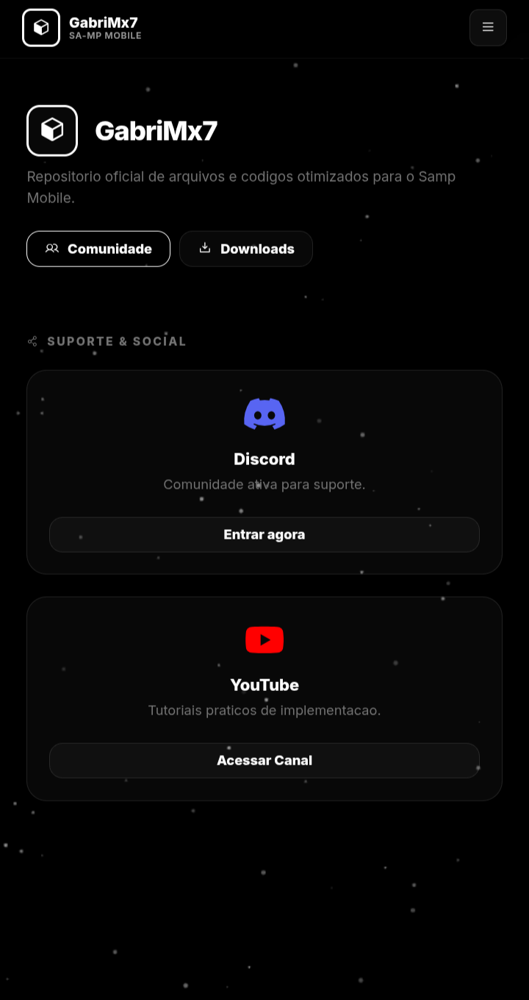

# 🚀 GabriMx7 - SA-MP Mobile Repository

  
   
  <b>Repositório oficial de arquivos e códigos otimizados para o Samp Mobile.</b>

  
  
  

---

## 📖 Sobre o Projeto

Este repositório hospeda o código-fonte e os recursos do site [gabrimx7.github.io](https://gabrimx7.github.io/). O objetivo do projeto é fornecer à comunidade de **San Andreas Multiplayer (SA-MP) Mobile** ferramentas otimizadas, launchers estáveis e modificações que melhoram a performance em dispositivos Android.

### ✨ Destaques do Site:
*   **APK Launcher:** Base otimizada para melhor compatibilidade com sistemas Android recentes.
*   **Gta Ant Lag (v24):** Arquivos de dados (DATA) modificados para ganho expressivo de FPS.
*   **Interface Gamer:** Design moderno, intuitivo e com suporte a Dark Mode.
*   **Central de Tutoriais:** Guias práticos para instalação e configuração.

---

## 🛠️ Tecnologias Utilizadas

O projeto foi desenvolvido com foco em leveza e rapidez, utilizando:

*   **HTML5 & CSS3:** Estrutura e estilização moderna (Dark Theme).
*   **JavaScript:** Lógica de navegação e interatividade.
*   **GitHub Pages:** Hospedagem gratuita e segura.

---

## 📥 Downloads e Recursos

| Recurso | Descrição | Formato |
| :--- | :--- | :--- |
| **APK Launcher** | Launcher base otimizado para Android. | `.apk` |
| **Gta Ant Lag v24** | Modificação para redução de lag e aumento de performance. | `.zip` |

---

## 🤝 Suporte e Social

Precisa de ajuda ou quer acompanhar as novidades? Junte-se a nós:

*   🌐 **Site Oficial:** [gabrimx7.github.io](https://gabrimx7.github.io/)
*   💬 **Discord:** [Comunidade Ativa](https://dsc.gg/gabrimx7)
*   🎥 **YouTube:** [Tutoriais e Novidades](https://youtube.com/@GabriMX7)

---

## ✍️ Créditos e Termos

*   **Desenvolvedor:** [GabriMx7](https://github.com/GabriMX7)
*   **Créditos:** Caso utilize ou republique as *Datas* ou *Arquivos* deste repositório, por favor, mantenha os devidos créditos ao desenvolvedor original.

---

  <i>"O luxo atrai os amigos, o sofrimento os seleciona."</i> — <b>GabriMx7</b>

